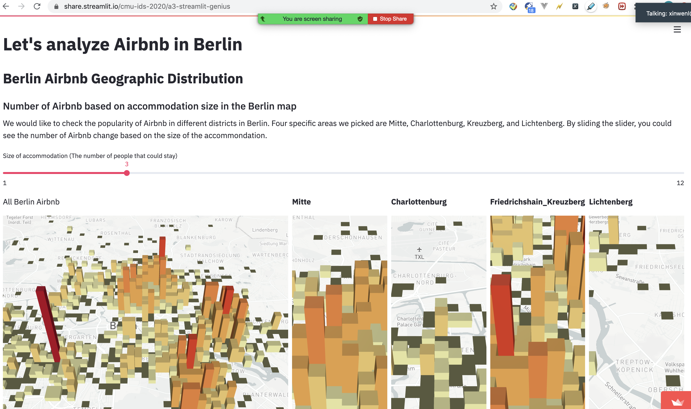

# Project name

## Project Goals

**A clear description of the goals of your project.** Describe the question that you are enabling a user to answer. The question should be compelling and the solution should be focused on helping users achieve their goals. 

We chose a dataset from the Inside Airbnb website and we specified our location in Berlin, Germany. Throughout our data exploration, our goal is to give business strategies for Airbnb hosts; in the other words, we are trying to use data analysis to help hosts make their future decisions based on the attributes like profits, neighborhood, time, and visitors’ needs.
Questions we are trying to solve:
1. How are Airbnbs distributed geographically (what are the relationships between geographical location and number of airbnbs)?
2. What are the relationships between geographical location and price?
3. Does price change overtime? When is the most expensive?
4. What attributes are related to an Airbnb listing's availability in 90 days?
5. What do customers care about?

## Design

**A rationale for your design decisions.** How did you choose your particular visual encodings and interaction techniques? What alternatives did you consider and how did you arrive at your ultimate choices?

• Neighborhood and counts (number of airbnbs)
    We tried to develop visualizations based on the questions we propose. In our first question, we would like to see which neighborhood has the most competition by comparing the numbers of Airbnb. In this set of maps, we used the slider “the size of accommodations”, which represents how many people could live in one particular Airbnb. The reason we want to use this specific attribute is because we would like Airbnb hosts to compare the competition based on the capacity of the room. We specifically choose “the size of accommodations” instead of the room type (single room, or whole apartment) is because we related back to our own Airbnb experience, where users tend to care more about the number of people who will be living in the house. Thus, it would be easier for hosts to count how many beds/rooms they need to prepare.
• Neighborhood and price
    Our violin plot graph visualizes the price among different districts, and through the density we could see the price range of Airbnb in Berlin, and evaluate the median price of Airbnb in different districts. By displaying this information, hosts could choose which neighborhood they would like to open an Airbnb to make the maximum profits.
• Price
    To help hosts have a deeper analysis about the profits, we create the line charts displaying the change of price over time. We include different categories in the line charts, like super host, neighborhood, number of beds, room type, room with availability in 365 days and review score. By including these attributes in our line charts, hosts could have a better understanding of which factor will affect the price most, and this will help them make decisions in starting Airbnb. For instance, in July and August, the price of hotel rooms increases a lot, and Airbnb hosts could slightly increase the price, but keep it lower than hotel rooms to earn extra profits. We thought about smoothing the line, but the current line shows weekly seasonality very clearly and there is no significant noise, so we decided to keep the line unsmoothed. When there are a lot of lines overlapping on the chart, it can be difficult to see the individual trends, so we made this chart more interactive - if you click on one line, all other lines will grey out to make the selected line observable. We also included a bar chart showing the distribution for each group so that hosts can also get a sense of how many competitors are in the category.
• Availability
    In the next interactive chart we include both violin plot and scatterplot chart to explore the elements that will affect the popularity of Airbnb. The hosts can select to see the relationship between availability in 90 days and other attributes such as whether the host is superhost, host acceptance rate, whether the room is instant bookable. The violin plot (for categorical attribute) / scatter plot (for quantitative attribute) on the top shows the relationship between availability and the selected attribute. The scatterplot at the bottom shows a room's review score against price. Hosts can brush through this scatterplot the select specific range of review score and price and see how the relationship between availability and the selected attribute changes in the upper chart. For example, when price increases and review score stays unchanged, availability increases no matter the host is superhost or not. When price is around 50 and review score is 95-100, the average availability of non superhost is lower than superhost. This indicates being a superhost is not extremely useful in terms of decreasing the available days. Our dataset is large, with 20000+ airbnb listings. To make it easier to interpret the scatterplot, we randomly sampled 1000 listings without replacement.
• Word cloud
    In the end, we have word cloud charts showing “what customer say.” The reason we want to include these charts is that we want to reveal users’ needs in the most direct way. We made word clouds from the visitors’ reviews, which include the important factors visitors are looking for when they choose Airbnb. For instances, “location”, “spacious”, “clean”, “helpful” are some of the key words; interestingly, we could also find some German comments like “bahn” (train), “unterkunft” (accommodation). These key words will help Airbnb hosts to better support their guests’ requirements and make improvements in the future.

## Development

**An overview of your development process.** Describe how the work was split among the team members. Include a commentary on the development process, including answers to the following questions: Roughly how much time did you spend developing your application (in people-hours)? What aspects took the most time?

Xinyu Lin is taking in charge of completing design for question 1 and 2. Xinyu is a novice in coding, so she learned the coding process of the “Uber pickup” example in Streamlit and tried to build another map graph visualizing the density of Airbnbs in Berlin. The most time she spent was on learning documentations and coding process, where many of the times the documentations were not clear and explicit, and she had a hard time displaying the visualization. She also found many limitations in using different packages in creating the map feature, which sometimes enforced her to change direction. She spent approximately 4 hours finding dataset, proposing questions and goals, discussing process with Xinwen, 6 hours learning the packages, and 12 hours developing the application.
 
Xinwen Liu focuses on designing visualization for question 3, 4, and 5. Xinwen spent 4 hours meeting with Xinyu as well, and roughly 13 hours developing the application. The difficult part was to deal with the large dataset. At first the initial dataset was too large that streamlit cannot load or process it. So Xinwen had to preprocess and pre-aggregate the data for each attribute in the "Price" section separately. Xinwen also spent a lot of time trying to setup the selection method that is connected to both the line chart and bar chart for "Price". However, because these two charts had to use different dataframes to get around with the large dataset problem, it was very difficult to combine their selection methods. Therefore, the selection was kept separate for these two graphs. Moreover, to let the word cloud display meaningful words, Xinwen also spent some time manually going through the word list to filter out the non-meaningful but very frequent words such as 'this', 'that', 'with', 'from'.